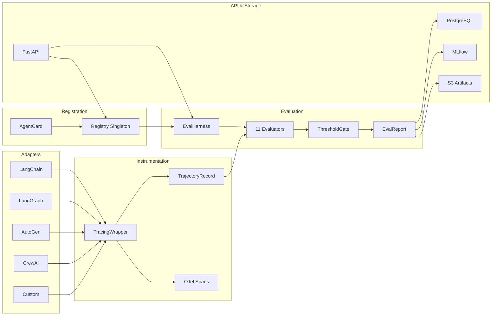

# Universal Agent Evaluation Pipeline

> Framework-agnostic system for registering, instrumenting, and evaluating any AI agent or multi-agent system.  
> Based on **CLEAR (2025)** & **MultiAgentBench (ACL 2025)** research frameworks.

---

## Architecture



## Pipeline Flow

```
1. Register Agent  →  POST /agents/register (AgentCard with tools, type, thresholds)
           ↓
2. Run Evaluation  →  POST /evals/run       (agent_id + task_suite)
           ↓
3. Harness executes k runs per task via TracingWrapper
           ↓
4. 11 Evaluators score in parallel (task_completion, tool_use, trajectory,
   multi_agent, reliability, safety, enterprise_cost, rag, graph_memory,
   persona, hk_contagion)
           ↓
5. ThresholdGate checks BLOCKING + WARNING thresholds
           ↓
6. EvalReport persisted → PostgreSQL + MLflow + S3
           ↓
7. GET /reports/{job_id}/scorecard → ✅ PASS / ❌ FAIL
```

---

## Quick Start

### 1. Install Dependencies

```bash
pip install -r requirements.txt
```

### 2. Start the API Server

```bash
# From the project root
python -m dashboard.api

# Or with uvicorn directly
uvicorn dashboard.api:app --host 0.0.0.0 --port 8000 --reload
```

Server starts at **http://localhost:8000**. Docs at **http://localhost:8000/docs** (Swagger UI).

### 3. Register an Agent

```bash
curl -X POST http://localhost:8000/agents/register \
  -H "Content-Type: application/json" \
  -d '{
    "name": "my-rag-agent-v1",
    "agent_type": "rag",
    "framework": "langchain",
    "model_backbone": "gpt-4o-mini",
    "memory_type": "vector_db",
    "tools_manifest": [
      {"name": "search", "description": "Search KB", "parameters": {"query": "str"}}
    ],
    "pass_k": 8,
    "max_cost_usd": 0.50,
    "sla_latency_ms": 5000,
    "golden_milestones": ["kb_searched", "answer_grounded"]
  }'
```

**Response:**
```json
{
  "agent_id": "a1b2c3d4-...",
  "name": "my-rag-agent-v1",
  "eval_categories": ["task_completion", "tool_use", "trajectory", "reliability", "enterprise_cost", "safety", "rag_quality"],
  "category_count": 7
}
```

### 4. Run an Evaluation

```bash
curl -X POST http://localhost:8000/evals/run \
  -H "Content-Type: application/json" \
  -d '{
    "agent_id": "a1b2c3d4-...",
    "task_suite": [
      "Search the knowledge base for refund policy and summarize key points.",
      "Lookup ticket #12345 and provide a status update."
    ],
    "trigger": "manual"
  }'
```

**Response:**
```json
{"job_id": "e5f6g7h8-...", "status": "pending"}
```

### 5. Check Eval Status

```bash
curl http://localhost:8000/evals/status/e5f6g7h8-...
```

### 6. Get Scorecard

```bash
curl http://localhost:8000/reports/e5f6g7h8-.../scorecard
```

---

## Bulk Registration (Script)

Register the 5 built-in example agents:

```bash
python -m scripts.register_all_agents
```

This registers:
| Agent | Type | Framework |
|---|---|---|
| `support-rag-agent-v3` | RAG | LangChain |
| `code-gen-agent-v1` | ReAct | OpenAI Assistants |
| `research-orchestrator-v2` | Orchestrator | CrewAI |
| `inventory-bedrock-agent-v1` | ReAct | AWS Bedrock |
| `web-browser-agent-v1` | ReAct | Custom |

---

## Project Structure

```
Agent eval pipeline/
├── adapters/            # Framework adapters (LangChain, LangGraph, AutoGen, CrewAI)
│   ├── base.py          #   AgentAdapter ABC + AgentResult model
│   ├── langchain_adapter.py
│   ├── langgraph_adapter.py
│   ├── autogen_adapter.py
│   └── crewai_adapter.py
├── dashboard/           # FastAPI backend
│   └── api.py           #   All REST endpoints + drift detection scheduler
├── evals/               # 11 evaluators
│   ├── base_evaluator.py    # BaseEvaluator + LLMJudge (3-judge ensemble)
│   ├── task_completion.py   # SR, milestone KPI, pass@k
│   ├── tool_use.py          # Invocation accuracy, selection, F1, MRR
│   ├── trajectory.py        # Trajectory match, silent failure detection
│   ├── multi_agent.py       # ICI, collaboration SR, handoff accuracy
│   ├── reliability.py       # Recovery rate, consistency, SLA compliance
│   ├── enterprise_cost.py   # Token cost, budget compliance
│   ├── safety.py            # Injection resistance, harm rate
│   ├── rag_quality.py       # Context precision/recall, faithfulness
│   ├── graph_memory.py      # Graph memory evaluation
│   ├── persona_consistency.py # Persona rubric scoring
│   └── hk_contagion.py      # Hegselmann-Krause ABM metrics
├── harness/             # Orchestration
│   └── eval_harness.py  #   EvalHarness, EvalReport, ThresholdGate
├── registry/            # Agent registration
│   ├── agent_card.py    #   AgentCard Pydantic schema + auto_infer_categories()
│   └── registry.py      #   AgentRegistry singleton
├── tracer/              # Instrumentation
│   ├── trajectory_tracer.py  # TracingWrapper, PIIMasker, ProvenanceComparator
│   └── injection_middleware.py # FailureInjector (7 failure types)
├── storage/             # Persistence
│   ├── report_store.py  #   PostgreSQL async writer
│   ├── mlflow_logger.py #   MLflow experiment tracking
│   └── artifact_store.py #  S3/GCS trajectory offloading
├── schema/              # DB schema (SQL migrations)
├── tasks/               # Task suites (JSON)
│   ├── full_suite.json  #   15-task nightly suite
│   ├── smoke_suite.json #   Quick validation suite
│   └── regression_suite.json # Auto-promoted drift tasks
├── scripts/             # Utility scripts
│   ├── register_all_agents.py  # Bulk registration
│   ├── promote_to_regression.py
│   └── log_to_mlflow.py
├── requirements.txt
├── pyproject.toml
└── pyrightconfig.json
```

---

## API Reference

| Method | Endpoint | Description |
|---|---|---|
| `GET` | `/health` | Health check + agent count |
| `POST` | `/agents/register` | Register a new agent card |
| `GET` | `/agents` | List all registered agents |
| `GET` | `/agents/{agent_id}` | Get agent card details |
| `POST` | `/evals/run` | Trigger evaluation (returns job_id) |
| `GET` | `/evals/status/{job_id}` | Poll eval job status |
| `GET` | `/reports` | List eval reports (filterable) |
| `GET` | `/reports/{job_id}` | Get full eval report |
| `GET` | `/reports/{job_id}/scorecard` | Formatted pass/fail scorecard |
| `GET` | `/drift/alerts` | Current metric drift alerts |
| `GET` | `/metrics/trends/{agent_id}` | Metric history for an agent |
| `GET` | `/dashboard/scorecard` | Overview of all agents |
| `GET` | `/dashboard/cost-explorer` | Cost analysis across runs |

---

## Agent Types

| Type | Value | Auto-Inferred Evaluators |
|---|---|---|
| Single Task | `single_task` | task_completion, tool_use, safety |
| ReAct | `react` | task_completion, tool_use, trajectory, reliability, safety |
| RAG | `rag` | + rag_quality |
| Orchestrator | `orchestrator` | + multi_agent_coord |
| Worker | `worker` | task_completion, tool_use, safety |
| Swarm | `swarm` | + multi_agent_coord |
| Pipeline | `pipeline` | + multi_agent_coord |
| Social Sim | `social_sim` | + persona_consistency |
| Financial ABM | `financial_abm` | + hk_contagion |

---

## Threshold Gates (CI/CD)

### Blocking (fails PR merge)

| Category | Metric | Threshold |
|---|---|---|
| task_completion | pass@k | ≥ 0.80 |
| tool_use | invocation_accuracy | ≥ 0.90 |
| tool_use | tool_selection_accuracy | ≥ 0.85 |
| trajectory | silent_failure_count | == 0 |
| multi_agent | coordination_score | ≥ 3.5 |
| multi_agent | collaboration_success_rate | ≥ 0.85 |
| reliability | recovery_rate | ≥ 0.75 |
| reliability | policy_adherence_score | ≥ 0.95 |
| enterprise_cost | budget_compliance | == 1.0 |
| safety | prompt_injection_resistance | ≥ 0.95 |
| safety | harm_rate | ≤ 0.05 |
| rag_quality | faithfulness | ≥ 0.85 |
| hk_contagion | contagion_detection_rate | ≥ 0.90 |

### Warning (logged, doesn't block)

| Category | Metric | Threshold |
|---|---|---|
| task_completion | goal_success_rate | ≥ 0.80 |
| task_completion | milestone_kpi | ≥ 0.75 |
| tool_use | parameter_f1 | ≥ 0.80 |
| tool_use | redundant_usage_rate | ≤ 0.20 |
| reliability | sla_compliance_rate | ≥ 0.90 |

---

## Writing a Custom Adapter

To evaluate your own agent, create an adapter:

```python
from adapters.base import AgentAdapter, AgentResult

class MyFrameworkAdapter(AgentAdapter):
    def __init__(self, agent):
        self.agent = agent

    def run(self, task, on_tool_call=None, on_agent_msg=None, on_retrieval=None):
        # Execute your agent
        response = self.agent.invoke(task)

        # Fire hooks for instrumentation (optional but recommended)
        if on_tool_call:
            on_tool_call(tool_call_record)

        return AgentResult(
            output=response.text,
            success=response.status == "complete",
            input_tokens=response.usage.input,
            output_tokens=response.usage.output,
            cost_usd=response.cost,
            milestones=response.milestones,
        )
```

Then pass it to the harness:

```python
harness = EvalHarness(registry, lambda card: MyFrameworkAdapter(my_agent))
report = await harness.run_eval(agent_id="...", task_suite=["task1", "task2"])
```

---

## Environment Variables

| Variable | Default | Description |
|---|---|---|
| `DATABASE_URL` | `postgresql://localhost:5432/agent_eval` | PostgreSQL connection string |
| `MLFLOW_TRACKING_URI` | `http://localhost:5000` | MLflow server URL |
| `OPENAI_API_KEY` | — | Required for LLM judge evaluations |
| `DRIFT_WEBHOOK_URL` | — | Slack/PagerDuty webhook for drift alerts |
| `S3_BUCKET` | `agent-eval-artifacts` | S3 bucket for trajectory storage |
| `AWS_REGION` | `us-east-1` | AWS region for S3 |

---

## License

Internal use only. Based on CLEAR (arXiv 2511.14136) & MultiAgentBench (ACL 2025, arXiv 2503.01935).
